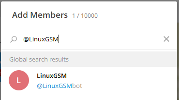

<a href="https://telegram.org/"><p align="center"></a>

<p align="center">Send LinuxGSM alerts to a Telegram Messenger user or group.</p>

# Setup a Telegram Bot

To enable Telegram alerts you need to create your own Telegram Bot.

1. Do do this you will need to speak to @BotFather by visiting [here](https://telegram.me/BotFather).

2. Click start to begin the chat. 


3. Type `/newbot` and follow the instructions the create a bot.


4. Once complete an API token will be given. Enter the token to the LinuxGSM config.
```
# Telegram Alerts | https://github.com/GameServerManagers/LinuxGSM/wiki/Telegram
telegramalert="on"
telegramtoken="401319987:AAGmgLWzYDprqkMHBjCT9qtzIRWCzqgoTLw"
telegramchatid=""

```

# Telegram Group
Use this step If you want to send alerts to a group. If not skip to _retrieve chat id_.

## Setup a New Group
1. Select `New Group`


2. Give your group a name


3. Select the Bot you just created by typing `@ExampleBot`.




The bot will now be added to the group.

# Use an Existing group

If you are using an existing group, invite the bot too the group.
```
View group info>Add Members.
```


# Retrieve the chat id

The chat id is used to identify where the alert is being sent. Each user and group has its own ID.

To obtain the chat id a message must be received by the bot. This will allow it to pick up the chat id
* users: send the message `LINUXGSM` directly to the bot
* groups: send the message `LINUXGSM` to the group

To retrieve the chat id visit the following url, replacing the `XXXXX` with your bot token from earlier.

```
https://api.telegram.org/botXXXXXXXXX:XXXXXXXXXXXXXXXXXXXXXXXXXXXXXXXXXXXX/getUpdates
```

Look for text `LINUXGSM` in the message and find the `chat id` part of that message.
```
"chat":{"id":-191537238,
```
The number given is the chat id
> note: That for a group the number includes a dash in the chat id e.g `-191537238`

Add the chat id to the LinuxGSM config

```
# Telegram Alerts | https://github.com/GameServerManagers/LinuxGSM/wiki/Telegram
telegramalert="on"
telegramtoken="401319987:AAGmgLWzYDprqkMHBjCT9qtzIRWCzqgoTLw"
telegramchatid="-191537238"
```
# Send Test Alert
Finally test that is correctly works by sending a test alert. You will now receive a message from the bot directly or to a chosen group.
```
./gameserver test-alert
```