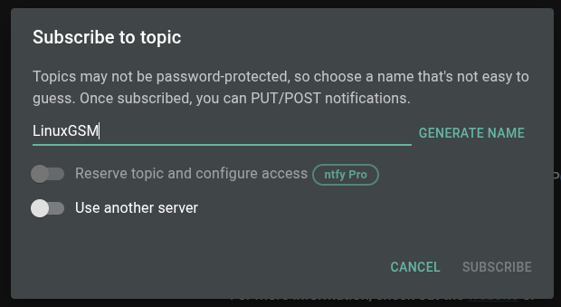

# ntfy


[ntfy] (pronounced notify) is a simple HTTP-based pub-sub notification service. It allows you to send notifications to your phone or desktop via scripts from any computer, and/or using a REST API.

## Configuring ntfy Alerts

1. **Subscribe to a topic**: for example, on desktop:

   

2. **Turn on ntfy alerts** in the [LinuxGSM settings](../configuration/linuxgsm-config.md). \(`~/lgsm/config-lgsm/<gameserver>/common.cfg`\)

_Note: The only required setting is to turn on `ntfyalert`, and set `ntfytopic` a unique topic if you are not selfhosting ntfy._

```text
# ntfy Alerts | https://docs.linuxgsm.com/alerts/ntfy
ntfyalert="on"
ntfytopic="your-topic-name" # Defaults to "LinuxGSM", you should use something unique.
ntfyserver="selfhosted-ntfy-url" # Defaults to "https://ntfy.sh", set if self-hosting ntfy.
ntfypriority=""
ntfytags=""

# If publishing to topics behind auth: https://docs.ntfy.sh/publish/#authentication
ntfytoken=""
ntfyusername=""
ntfypassword=""
```
