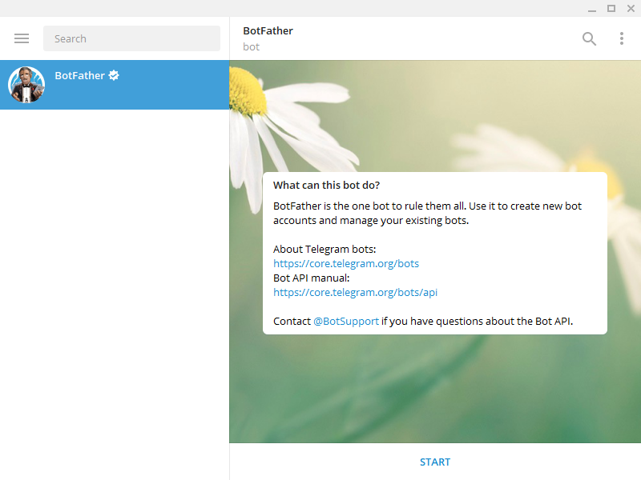
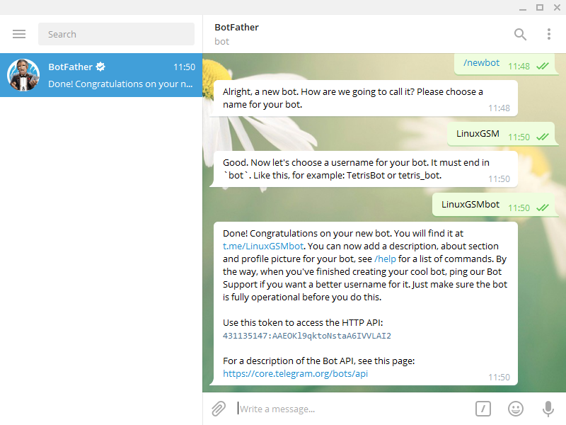

# Telegram

[Telegram](https://telegram.org) is an instant messaging app that provides a powerful API that enables applications to send messages through bots. LinuxGSM leverages the [Telegram Bot API](https://core.telegram.org/bots/api) to dispatch alerts to users, enhancing monitoring and management of gaming servers.

## Creating a Telegram Bot

1. **Initiate Bot Creation**: Chat with [@BotFather](https://telegram.me/BotFather) on Telegram to start creating your bot. Begin the conversation by clicking "Start".

2. **Register Your Bot**: Send `/newbot` to @BotFather and follow the provided instructions to set up your bot. Upon completion, you will receive an API token.

    

    

3. **Configure LinuxGSM**: Fill in the API token into your [LinuxGSM config](../configuration/linuxgsm-config.md) as follows:

    ```bash
    # Telegram Alerts | https://docs.linuxgsm.com/alerts/telegram
    telegramapi="api.telegram.org"
    telegramalert="on"  # Enable alerts by changing "off" to "on"
    telegramtoken="XXXXXXXXX:XXXXXXXXXXXXXXXXXXXXXXXXXXXXXXXXXXXX" # Replace with your bot token
    telegramchatid=""
    telegramthreadid=""
    telegramsilentnotification="false" # Set to "true" to disable notification sounds and send alerts silently
    curlcustomstring=""  # Optional: For proxies, etc.
    ```

## Configuring Alerts for a Group

### New Group Creation

1. Select `New Group` within Telegram.
2. Name your group.
3. Add your bot by searching its `@Username`.

### Adding to an Existing Group

1. Open group info.
2. Choose to add members.
3. Search and select your bot by its `@Username`.

## Retrieving Your Telegram Chat ID

1. **Activate Your Bot**: Interact with your bot in Telegram.
2. **Form the getUpdates URL**: Replace the placeholder with your bot's token in `https://api.telegram.org/botXXXXXXXXX:XXXXXXXXXXXXXXXXXXXXXXXXXXXXXXXXXXXX/getUpdates`.
3. **Visit the URL**: Use a web browser to access the URL.
4. **Locate the Chat ID**: In the JSON response, find the `id` field under the `chat` object.

    ```json
    "chat": {
        "id": 123456789,
        "first_name": "Your Name",
        "username": "YourUsername",
        "type": "private"
    }
    ```

    Note: The Chat ID for private chats is a positive number and for a group, it's a negative number.

5. **Update LinuxGSM Config**: Place your Chat ID in the [LinuxGSM config](../configuration/linuxgsm-config.md) file.

    ```bash
    # Telegram Alerts | https://docs.linuxgsm.com/alerts/telegram
    telegramapi="api.telegram.org"
    telegramalert="on"
    telegramtoken="XXXXXXXXX:XXXXXXXXXXXXXXXXXXXXXXXXXXXXXXXXXXXX"
    telegramchatid="123456789" # Fill in your chat ID
    telegramthreadid=""
    telegramsilentnotification="false"
    curlcustomstring=""
    ```

## Enabling Telegram Topics (Threads)

1. Verify that Topics are enabled for your group by checking the group's settings.
2. If you don't already have a topic created. Create a new Topic by clicking the three dots in the top right corner of the group chat and selecting `New Topic`.
3. Send a message in the Topic you want to use.
4. Repeat [Retrieving Your Telegram Chat ID](#retrieving-your-telegram-chat-id) to retrieve the thread ID by looking for the `message_thread_id` field in the `message` object.

    ```json
    {
    	"update_id": 123456,
    	"message": {
    		"message_id": 123,
    		"from": {
    			"id": 12345,
    			"is_bot": false,
    			"first_name": "Sender",
    			"username": "SenderUsername",
    			"language_code": "en"
    		},
    		"chat": {
    			"id": -123456789,
    			"first_name": "Your Name",
    			"username": "YourUsername",
    			"type": "supergroup"
    		},
    		"date": 1709691014,
    		"message_thread_id": 11, // Use this number as your telegramthreadid
    		"forum_topic_created": {
    			"name": "LinuxGSM",
    			"icon_color": 12345
    		},
    		"is_topic_message": true
    	}
    }
    ```

5. Update the `telegramthreadid` field in the [LinuxGSM config](../configuration/linuxgsm-config.md) with the thread ID.

    ```bash
    # Telegram Alerts | https://docs.linuxgsm.com/alerts/telegram
    telegramapi="api.telegram.org"
    telegramalert="on"
    telegramtoken="XXXXXXXXX:XXXXXXXXXXXXXXXXXXXXXXXXXXXXXXXXXXXX"
    telegramchatid="123456789"
    telegramthreadid="5" # Fill in your thread ID
    telegramsilentnotification="false"
    curlcustomstring=""
    ```

## Testing the Configuration

Execute a test alert with `./gameserver test-alert` to verify the setup.

If you receive an alert on Telegram in the right place (group or private chat), the configuration is correct.

## Advanced Configuration: Custom cURL String

For specific needs such as bypassing network restrictions, you can specify custom cURL arguments in the configuration.

````bash
    # Telegram Alerts | https://docs.linuxgsm.com/alerts/telegram
    # You can add a custom cURL string eg proxy (useful in Russia) in "curlcustomstring".
    # For example "--socks5 ipaddr:port" for socks5 proxy see more in "curl --help all".
    telegramapi="api.telegram.org"
    telegramalert="on"
    telegramtoken="XXXXXXXXX:XXXXXXXXXXXXXXXXXXXXXXXXXXXXXXXXXXXX"
    telegramchatid="123456789"
    telegramthreadid="5"
    telegramsilentnotification="false"
    curlcustomstring="--socks5 ipaddr:port" # Fill in your custom cURL string
    ```
````
