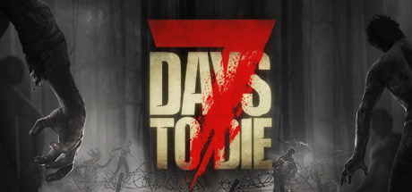

# 7 Days to Die

## Server Resources

-   [Official Dedicated Server Guide](https://7daystodie.fandom.com/wiki/Server)

## Telnet

7 Days to Die uses telnet to admin the server. This is enabled by default with no password however will only listen on localhost.
