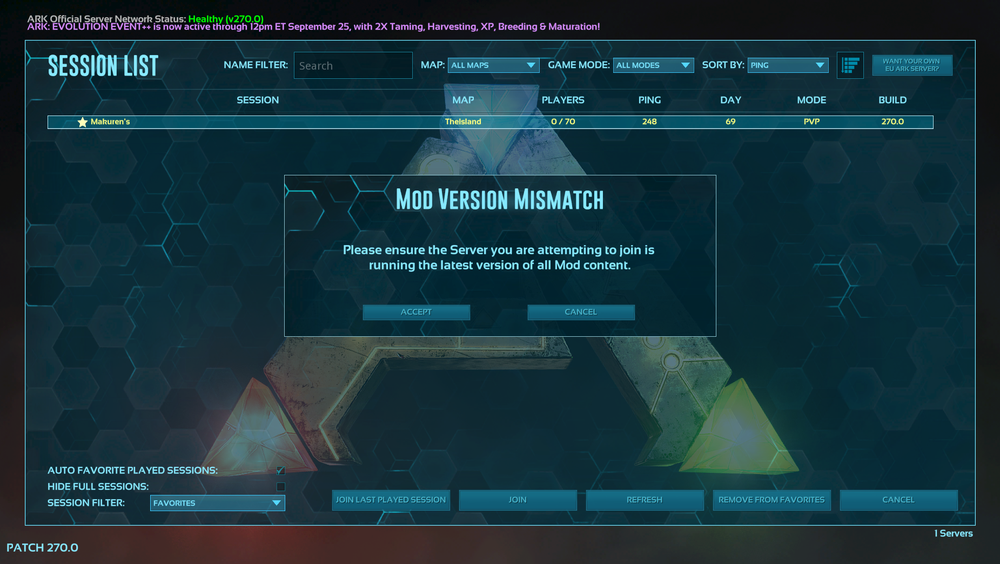

# ARK: Survival Evolved


## Server Resources

* [Official Dedicated Server Guide](https://ark.wiki.gg/wiki/Dedicated\_server\_setup)
* [Official Dedicated Server Configuration](https://ark.wiki.gg/wiki/Server\_configuration)
* [Steam Workshop](https://steamcommunity.com/app/346110/workshop/)
* [Official ARK: Survival Evolved Server Administration forum](https://survivetheark.com/index.php?/forums/forum/39-server-administration/)

## System Requirements

Different Maps require different system requirements.

* TheIsland: 7GB RAM
* Genesis 2: 12GB RAM

## Config Files

An example of GameUserSettings.ini can be found [here](https://github.com/GameServerManagers/Game-Server-Configs/blob/main/ark/GameUserSettings.ini).

```
serverfiles/ShooterGame/Saved/Config/LinuxServer/GameUserSettings.ini
serverfiles/ShooterGame/Saved/Config/LinuxServer/Game.ini
```

## Server Settings

### Common Command-Line Options

Below is a list of common Command-Line options. For a complete list see the [Ark Wiki](https://ark.wiki.gg/wiki/Server\_configuration#Command\_line\_options).

| Parameter                              | Description                                                                                                                                                                                                                                                                                                                                                                                                                |
| -------------------------------------- | -------------------------------------------------------------------------------------------------------------------------------------------------------------------------------------------------------------------------------------------------------------------------------------------------------------------------------------------------------------------------------------------------------------------------- |
| SessionName                            |                                                                                                                                                                                                                                                                                                                                                                                                                            |
| -MultiHome                             | Enables multihoming.                                                                                                                                                                                                                                                                                                                                                                                                       |
| -Port                                  |                                                                                                                                                                                                                                                                                                                                                                                                                            |
| -QueryPort                             |                                                                                                                                                                                                                                                                                                                                                                                                                            |
| -AutoManagedMods                       | Steam only, automatic MOD download/installation/updating. Mod IDs are listed in _Game.ini_ under `[ModInstaller]` section.                                                                                                                                                                                                                                                                                                 |
| -CrossPlay                             | Enables crossplay (i.e.: EPIC and Steam) on dedicated server. Note: PublicIPForEpic must also be set.                                                                                                                                                                                                                                                                                                                      |
| -PublicIPForEpic=\<IPAddress>          | This is the public IP that EGS clients will attempt to connect to, if this option is missing and `-MULTIHOME` is specified, then EGS clients will attempt to connect to the multihome IP; note that if you're using multihome and specify a non-public IP address, then players will not be able to connect to your server using EGS. Make sure to set a public IP address (e.g.: WAN or external).                        |
| -NoBattlEye                            | Run server without BattleEye.                                                                                                                                                                                                                                                                                                                                                                                              |
| -ActiveEvent=                          | Enables a specified event or enables the event's colour palette on wild creatures. Only one can be specified and active at a time.                                                                                                                                                                                                                                                                                         |
| ?AltSaveDirectoryName=\<savedir\_name> | Allows to specify a custom directory name for server world-save. Usually used to manage clusters, read more about it in the [Cross-ARK Data Transfer](https://ark.wiki.gg/wiki/Server\_configuration#Cross-ARK\_Data\_Transfer) section.                                                                                                                                                                                   |
| -insecure                              | Disable Valve Anti-Cheat (VAC) system.                                                                                                                                                                                                                                                                                                                                                                                     |
| -MapModID=                             | Dedicated servers can now optionally load custom maps via `ModID` directly, rather than having to specify the map name, using this syntax (where the `MapModID` is the Steam Workshop ID of your custom map, and the GameModIds are the Id’s of the stacked mods you wish to use, in order). `ActiveMods` must also be set in [GameUserSettings.ini](https://ark.wiki.gg/wiki/Server\_configuration#GameUserSettings.ini). |
| ?GameModIds=\[,\[...]]                 | Steam only. Specifies the order and which mods are loaded, `ModIDs` need to be separated with commas (`,`). Mod priority is in descending order left to right (the left-most ID is the top priority mod). It is suggested to use instead the `ActiveMods` under `[ServerSettings]` of _GameUserSettings.ini_.                                                                                                              |

### Common Configuration Settings

Below is a list of common Configuration settings. For a complete list see the [Ark Wiki](https://ark.wiki.gg/wiki/Server\_configuration#Configuration\_Files).

The following options must come under the `[ServerSettings]` section of `GameUserSettings.ini`:

| Variable                                         | Description                                                                                                                        |
| ------------------------------------------------ | ---------------------------------------------------------------------------------------------------------------------------------- |
| ActiveMods=ModID1,ModID2,ModID3                  | _Value type: list of mod IDs, comma-separated with no spaces, in a single line (for example: `ModID1,ModID2,ModID3`)_              |
| BanListURL="http://arkdedicated.com/banlist.txt" | <p><em>Value type: string with a URL</em><br>Sets the global ban list. Must be enclosed in double-quotes. </p>                     |
| RCONEnabled=True                                 | f `True`, enables RCON, needs `RCONPort=<TCP_PORT>` and `ServerAdminPassword=<admin_password>` to work                             |
| RCONPort=27020                                   | Specifies the optional TCP RCON Port.                                                                                              |
| ServerAdminPassword=                             | If specified, players must provide this password (via the in-game console) to gain access to administrator commands on the server. |
| ServerPassword=                                  | If specified, players must provide this password to join the server.                                                               |
| serverPVE=                                       | If `True`, disables [PvP](https://ark.wiki.gg/wiki/PvP) and enables [PvE](https://ark.wiki.gg/wiki/PvE)                            |

The following options must come under the `[SessionSettings]` section of `GameUserSettings.ini`.


<table><thead><tr><th width="187">Variable</th><th>Description</th></tr></thead><tbody><tr><td>SessionName</td><td>Specifies the Server name advertised in the Game Server Browser as well in Steam Server browser. If no name is provide, the default name will be <em>ARK #</em> followed by a random 6 digit number</td></tr></tbody></table>

The following options must come under the `[/Script/Engine.GameSession]` section of `GameUserSettings.ini`.


<table><thead><tr><th width="176">Variable</th><th>Description</th></tr></thead><tbody><tr><td>MaxPlayers=70</td><td>Specifies the maximum number of players that can play on the server simultaneously.</td></tr></tbody></table>

The section `[ModInstaller]` handles each extra Steam Workshop Mods/Maps/TC IDs in the `Game.ini`.

| Variable          | Description                                                                                                                                                                                                                                                     |
| ----------------- | --------------------------------------------------------------------------------------------------------------------------------------------------------------------------------------------------------------------------------------------------------------- |
| ModIDS=\<integer> | Specifies a single Steam Workshop Mods/Maps/TC ID to download/install/update on the server. To handle multiple IDs, multiple lines must be added with the same syntax, each one with the specific workshop ID. Requires `-automanagedmods` in the command line. |

## Alt Saved Directory Name

```
altsavedirectoryname=
```

The `altsavedirectoryname` is the location where the game save will be stored; by default, this is the current map name. However, this setting can be customised if desired.


Be careful not to accidentally overwrite a save file if changing maps or using a custom save location.


If `altsaveddirectoryname` is `TheIsland` the save is located will be:

```
ShooterGame/Saved/TheIsland
```

## Official Map Names

* TheIsland
* TheCenter
* ScorchedEarth\_P
* Ragnarok
* Aberration\_P
* Extinction
* Valguero\_P
* Genesis
* CrystalIsles
* Gen2
* LostIsland
* Fjordur
* PGARK

## Mod Support

ARK server mods are managed using the [Steam Workshop](https://steamcommunity.com/app/346110/workshop/), this allows the auto-install and update of mods.

### Adding Mods

Firstly, you need to select the mods you want to use from the [Steam Workshop](https://steamcommunity.com/app/346110/workshop/).


Mods can cause your server to become unstable or may not be compatible with each other. It is a good idea to read the mods docs and/or speak with other experienced ARK admins.


Here is a simple mod to get started:

* [Editable Server UI (WBUI) Open Source - 924619115](https://steamcommunity.com/sharedfiles/filedetails/?id=924619115)

`-automanagedmods` is the required [parameter](../configuration/start-parameters.md) to add workshop support and is added to the start parameters by default.

Edit `GameUserSettings.ini`, adding the following line under `[ServerSettings]`. To add multiple mods use a comma delimiter e.g `ActiveMods=924619115,924619652`.

```
[ServerSettings]
ActiveMods=924619115
```

Next, edit or create `Game.ini` and add the following section, this will enable the auto-download of mods. To add multiple mods add another `ModIDS=` line underneath the first.

```
[ModInstaller]
ModIDS=924619115
```

For the example mod add the following to `GameUserSettings.ini` other mods may require their own configuration as per their documentation.

```
[WBUI]
Icon=1
OpenBtn=0
HideBuff=true
HideAfter=60
TribeTab=true
OpenOnStart=true
OnlyNewPlayers=true
UseJson=false
JsonURL="https://dl.dropboxusercontent.com/s/6rhwbq95wwm5gkd/UI.json"
UpdateInterval=24
```

For more config options for WBUI see this [link](https://steamcommunity.com/workshop/filedetails/discussion/924619115/129069130858283275).

Start the server and the mods will be automatically downloaded by the server. To check that this has worked open the console `./arkserver console`. In the console, you will see a message similar to the following.


Large mods may take several minutes to download to the server.


```
Using binned.
4.5.1-0+UE4 7038 3077 404 10
[S_API FAIL] SteamAPI_Init() failed; SteamAPI_IsSteamRunning() failed.
Setting breakpad minidump AppID = 346110
Redirecting stderr to '/home/lgsm/.steam/logs/stderr.txt'
[  0%] Checking for available updates...
[----] Verifying installation...
Steam Console Client (c) Valve Corporation
-- type 'quit' to exit --
Loading Steam API...Failed to init SDL priority manager: SDL not found
Failed to set thread priority: per-thread setup failed
Failed to set thread priority: per-thread setup failed
OK.

Connecting anonymously to Steam Public...Loaded client id: 13529975768029855698
Listening for IPv4 broadcast on: 27036
Logged in OK
Waiting for user info...OK
Downloading item 679529026 ...
Success. Downloaded item 679529026 to "/home/lgsm/.steam/SteamApps/workshop/content/346110/679529026" (1365998905 bytes)
```

If you join before the server or your client has fully downloaded the mod you might get a _Mod Version Mismatch_ error. Simply, give the server more time to load the mods.



Once you have connected to the server you will be able to see that the mod has loaded by seeing the _Mod Name_ in the game menu `Esc`.

 (1) (1) (1) (1) (1) (1) (1) (1).png>)

The example mod can be activated by pressing `F1`.


### Mod Collections

The Steam Workshop has a feature that allows mods to be grouped in collections. Currently, Steam workshop collection IDs won't work directly with ARK. Instead, you need to have all the individual IDs of the mods you want to use.


To get individual item IDs from collections you can use the [Steam Collection ID Grabber](https://tools.rusty.info/tools/stcolids/).


## IP Addressing

### Multihome&#x20;

The `-multihome` parameter is used to bind the server to a specific interface. By default, LinxuGSM sets this to the `${ip}` variable.

### PublicIPForEpic

If you want players who use the Epic Store to connect to the server the `-PublicIPForEpic` parameter. By default, LinuxGSM will set this to `${publicip}` variable.

## Clusters

A cluster allows an admin to group ARK servers together, usually servers on different maps. Allowing the transfer of characters between the different servers.

### Multi-Instance

ARK will not work with LinuxGSM [multi instances ](../configuration/multiple-game-servers.md)in the same directory. This is due to its reliance on `GameUserSettings.ini` meaning multiple instances must use the same settings.

### Adding Servers to Clusters

Firstly, set up [multiple ARK game server instances](../configuration/multiple-game-servers.md).

Change the command-line parameters for your server instances by editing the instance configs:

**arkserver.cfg**

```
port="7777"
queryport="27015"
rconport="27020"
```

```
TheIsland?SessionName=LinuxGSM Session 1?AltSaveDirectoryName=${defaultmap}?listen?MultiHome=${ip}?MaxPlayers=${maxplayers}?QueryPort=${queryport}?RCONPort=${rconport}?Port=${port} -automanagedmods -NoTransferFromFiltering -clusterid=cluster1
```

**arkserver-2.cfg**

```
port="7779"
queryport="27017"
rconport="27022"
```

```
Ragnarok?SessionName=LinuxGSM Session 2?AltSaveDirectoryName=?ScorchedEarth_P?listen?MultiHome=${ip}?MaxPlayers=${maxplayers}?QueryPort=${queryport}?RCONPort=${rconport}?Port=${port} -automanagedmods -NoTransferFromFiltering -clusterid=cluster1
```


Servers that are running on _local networks_ sometimes have trouble traveling to other arks. A potential fix for this is adding `MultiHome=0.0.0.0` to your command-line parameters.

