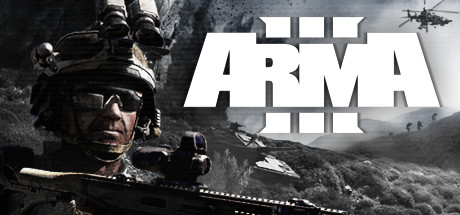

# Arma 3



## Resources

* [ArmA3 Server tutorial](https://forums.bohemia.net/forums/topic/139003-tutorial-installation-configuration-of-arma3-dedicated-server/)

## Headless Client

### Headless Client Overview

[https://community.bistudio.com/wiki/Arma\_3\_Headless\_Client](https://community.bistudio.com/wiki/Arma_3_Headless_Client)

* Headless Client is used to off load AI calculations from the server.
* Headless Client is integrated into game client and dedicated server executable \(Windows and Linux, use -client parameter\).
* The server does not allow arbitrary connections from headless clients if you do not define the headless clients IPs in the server.cfg.

### Headless Client Setup and Usage

Starting up a headless client and having it connect to your server is easy, Creating a mission that uses the Headless Client is not.


This guide only handles the setup and connecting a headless client.


> note: All references to `arma3server` are referring the script you use to start your server, not the server executable itself unless noted.

Create a [new server instance](../features/multiple-game-servers.md) using LinuxGSM `./linuxgsm.sh arma3server`. This will become the headless client instance and rename the new instance to `arma3server-hc`.

Edit the config file `lgsm/config-lgsm/arma3server-hc.cfg`.

Change the `port=` increasing the number by a factor of 12 e.g 2303 becomes 2314.

Update `startparameters=` changing it to the following.

```text
startparmaters="-client -connect=${ip}:${port} -password=CHANGEME"
```

Edit the game server config of `arma3server` \(not the headless client\) `arma3server.server.cfg` and add the headless client IP address to `headlessClients[]=`. If the headless client is on the same physical server as the ARMA 3 server then also add the IP to `localClient[]=`.


Do not use 127.0.0.1 as the IP address.


```text
headlessClients[]={"1.2.3.4"}; 
localClient[]={"1.2.3.4"};
```

Navigate to your profile directory.

```text
~cd ~/.local/share/Arma\ 3\ -\ Other\ Profiles
```

edit `Player.Arma3Profile` and add the line `battleyeLicense=1;`.

Start your server with `./arma3server start` 

Start your headless client with `./arma3server-hc start`.

Only an admin can see the headless clients in the player menu on the server. The headless client will connect and automatically assume the first available headless client slot.



## Mod Support

Arma 3 mods are managed using the [Steam Workshop](https://steamcommunity.com/app/346110/workshop/) or manual downloads.

### Adding Mods

Firstly, you need to select the mods you want to use from the [steam workshop](https://steamcommunity.com/app/346110/workshop/).


Mods can cause your server to become unstable or may not be compatible with each other. It is a good idea to read the mods docs and/or speak with other experienced Arma3 admins.


Here is a popular mod to get started:

*  [CBA: Community Based Addons for Arma 3](https://steamcommunity.com/workshop/filedetails/?id=450814997)

Download the Mod using [https://steamworkshopdownloader.io/](https://steamworkshopdownloader.io/) the workshop id is `450814997`

Create a directory called `@cba_a3` in `serverfiles/mods`

```text
serverfiles/mods/@cba_a3
```

Copy the contents of the mod archive to the `@cba_a3` directory.


Remember to check you have the correct user permissions once uploaded


Copy the contents of the `@cba_a3/keys` directory to the server keys directory.

```text
cp serverfiles/mods/@cba_a3/keys/* serverfiles/keys
```

Add @cba\_a3 to the `mods=""` setting in the [LinuxGSM config](../configuration/linuxgsm-config.md).

```text
mods="mods/@cba_a3"
```

If you are adding multiple mods make sure you put a semicolon in between each mod.

```text
mods="mods/@mod1;mods/@mod2"
```

### Lower Case file names

Arma 3 server requires that mods have lowercase names. Some mods do not do this and will need to have there file names converted to lowercase.

This can be done by using the following script.

Run the script from the `serverfiles/mods` directory.

```bash
#!/bin/bash
depth=0
for x in $(find . -type d | sed "s/[^/]//g")
do
if [ ${depth} -lt ${#x} ]
then
   let depth=${#x}
fi
done
echo "the depth is ${depth}"
for ((i=1;i<=${depth};i++))
do
  for x in $(find . -maxdepth $i | grep [A-Z])
  do
    mv $x $(echo $x | tr 'A-Z' 'a-z')
  done
done
```

Start the server and check that your mods all have valid hashes.  
You should see the "Community Base Addons" mod appear in your `console` [log](../features/logging.md)file.

```text
15:27:37 ============================================================================================= List of mods ===============================================================================================
15:27:37 modsReadOnly = true
15:27:37 safeModsActivated = false
15:27:37 customMods = true
15:27:37 hash = 'B44C8332DD951EC30619282DAC7A59519AA0BCB6'
15:27:37 hashShort = '185e1b29'
15:27:37                                               name |               modDir |    default |   official |               origin |                                     hash | hashShort | fullPath
15:27:37 ----------------------------------------------------------------------------------------------------------------------------------------------------------------------------------------------------------
15:27:37                      Community Base Addons v3.15.3 |              @cba_a3 |      false |      false |             GAME DIR | fa100065ad10a6ab7a5e16d53efc2b26f3df3b58 |  7f1d8e45 | /home/lgsm/arma3server/serverfiles/@cba_a3
15:27:37                                  Arma 3 Art of War |                  aow |       true |       true |             GAME DIR | 93cf5270ce855921dcfd261c583983d4e0bb6899 |  2930da71 | /home/lgsm/arma3server/serverfiles/aow
15:27:37                          Arma 3 Contact (Platform) |                enoch |       true |       true |             GAME DIR | 61e8060b8dce2727f235695e59de01089546d9ad |  2dd9b92b | /home/lgsm/arma3server/serverfiles/enoch
15:27:37                                       Arma 3 Tanks |                 tank |       true |       true |             GAME DIR | 37296b3dd900117d055e6c13e1ce21e54cd8067b |  dfc0778f | /home/lgsm/arma3server/serverfiles/tank
15:27:37                                     Arma 3 Tac-Ops |               tacops |       true |       true |             GAME DIR | dec763aedfdc28eab838361370a48f2411535e5a |  70a109b7 | /home/lgsm/arma3server/serverfiles/tacops
15:27:37                                 Arma 3 Laws of War |               orange |       true |       true |             GAME DIR | a786e1c2e7b3aec524cc1ce932039dc18da0351d |  128b066b | /home/lgsm/arma3server/serverfiles/orange
15:27:37                                      Arma 3 Malden |                 argo |       true |       true |             GAME DIR | b9edefa0cd211d0961282ce9b69eabeb59bda780 |  1954e272 | /home/lgsm/arma3server/serverfiles/argo
15:27:37                                        Arma 3 Jets |                 jets |       true |       true |             GAME DIR | cd6561bc9148fec23b136de7fa02bfbd71e12221 |  1f2e3b6f | /home/lgsm/arma3server/serverfiles/jets
15:27:37                                        Arma 3 Apex |            expansion |       true |       true |             GAME DIR | 2d573cab31befb9729503ed00c211628c73622cc |  e5ad6f6c | /home/lgsm/arma3server/serverfiles/expansion
15:27:37                                    Arma 3 Marksmen |                 mark |       true |       true |             GAME DIR | f0784723164eb212a22fa2d49e589bead97a9735 |  2d4eada7 | /home/lgsm/arma3server/serverfiles/mark
15:27:37                                 Arma 3 Helicopters |                 heli |       true |       true |             GAME DIR | 1af5847f6b557b98763dfdad7be3c32491cee65e |  873ada67 | /home/lgsm/arma3server/serverfiles/heli
15:27:37                                       Arma 3 Karts |                 kart |       true |       true |             GAME DIR | 5ebe4af2ae6777d560a14cf9e39d4ee3f852a75c |  3a3f5ff9 | /home/lgsm/arma3server/serverfiles/kart
15:27:37                                        Arma 3 Zeus |              curator |       true |       true |             GAME DIR | 351bd6e8b13a4e8f514a173bf78dd949c899e107 |   b6d4451 | /home/lgsm/arma3server/serverfiles/curator
15:27:37                                             Arma 3 |                   A3 |       true |       true |            NOT FOUND |                                          |           |
15:27:37 ==========================================================================================================================================================================================================
```

