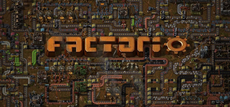
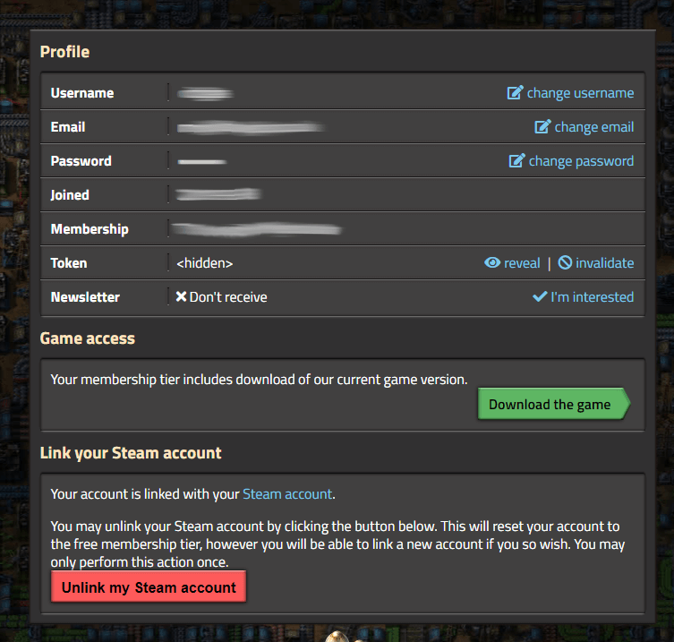

# Factorio



## Server Resources

* [World generation](https://wiki.factorio.com/World_generator)
* [Factorio server Wiki](https://wiki.factorio.com/Multiplayer)
* [Factorio console commands](https://wiki.factorio.com/Console#Command_line_parameters)

## Server Configuration

Configuration for Factorio is split between both the [game server config](../configuration/game-server-config.md) and [start parameters](../configuration/start-parameters.md).

### LinuxGSM Server Config 

port, rcon and branch configuration is set using stat parameters

```text
## Server Start Settings | https://docs.linuxgsm.com/configuration/start-parameters
ip="0.0.0.0"
port="34197"
rconport="34198"
rconpassword="Change_Me"
# (stable|experimental)
branch="stable"
```

### Game Server Config

All other settings are located in the Factorio [game server config](../configuration/game-server-config.md).

```bash
serverfiles/data/fctrserver.json
```

Useful settings include:

```text
"name": "Name of the game as it will appear in the game listing",
"description": "Description of the game that will appear in the listing",
"tags": ["game", "tags"],

"_comment_max_players": "Maximum number of players allowed, admins can join even a full server. 0 means unlimited.",
"max_players": 0,

"game_password": "",

"_comment_autosave_interval": "Autosave interval in minutes",
"autosave_interval": 10,

"_comment_autosave_slots": "server autosave slots, it is cycled through when the server autosaves.",
"autosave_slots": 5,
```

### Server Credentials

If you want your server to be publicly listed on the server browser you will need to enter your profile credentials from the [Factorio website](https://www.factorio.com/profile). You can use either a _token_ or _password_.



```bash
"_comment_credentials": "Your factorio.com login credentials. Required for games with visibility public",
"username": "",
"password": "",

"_comment_token": "Authentication token. May be used instead of 'password' above.",
"token": "",
```

## World Generation Settings

### Overview

Specifying world generation settings is a fairly simple task when creating a new world.

The steps to do so are as follows:

1. Delete any existing world data
2. Modify `map-gen-settings.json`
3. Use the Factorio executable to generate a world with that json
4. Run Factorio as normal

Follow the Guide below for detailed instructions on doing the above.

### Adjusting World Generation Settings

Firstly, delete any existing worlds that are found in the `serverfiles` directory.


Remember to backup your server


```bash
cd serverfiles
rm save1.zip # this will delete your world.
rm -r saves # this directory will only exist if you have ran the server.
```

In the `data` directory, copy the example files, then and customise them to your requirements.

```bash
cd data
cp map-gen-settings.example.json map-gen-settings.json
cp map-settings.example.json map-settings.json
```

In `map-gen-settings.json`, the [ore generation values](https://lua-api.factorio.com/latest/Concepts.html#MapGenSize) can be:

```text
"none" - equivalent to 0
"very-low", "very-small", "very-poor" - equivalent to 1/2
"low", "small", "poor" - equivalent to 1/sqrt(2)
"normal", "medium", "regular" - equivalent to 1
"high", "big", "good" - equivalent to sqrt(2)
"very-high", "very-big", "very-good" - equivalent to 2
```

Once complete you will need to generate your World. Go back to the `serverfiles` directory and run the Factorio binary.

```bash
cd ../
./bin/x64/factorio --create ./save1.zip --map-gen-settings data/map-gen-settings.json --map-settings data/map-settings.json
```

### Adjusting World Generation Settings \(Mods\)

I prefer the added customisation of the [Resource Overhaul Mod](https://mods.factorio.com/mods/orzelek/rso-mod) to the built-in generation.

The easiest way that I've found to generate a world with the RSO mod \(and add mods in general\) is as follows:

1. Startup Factorio on a client and install the RSO mod
2. Start generation of a new world and configure mod generation settings
3. Grab the mod files and `mod-settings.dat`
4. Transfer them to the server 
5. Delete or rename any previous worlds

To configure the generation, go to `Play` &gt; `New World` &gt; `Mod Settings` &gt; `Map`, then adjust options accordingly. Doing so will generate a file called `mod-settings.dat` which stores these settings.

You can locate the mod files on your system in the path [your Factorio installation saves to](https://wiki.factorio.com/Application_directory/Changing_the_save_directory):

```text
Windows (Zip file): <install directory>\mods
Windows (Installer): C:\Users\<username>\AppData\factorio\mods
Windows (Steam): C:\Users\<username>\AppData\Roaming\factorio\mods
OSX: ~/Library/"Application Support"/factorio/mods
Linux: ~/.factorio/mods
```

Transfer all of the mods and `mod-settings.dat` file to your server with a tool like [Filezilla](https://filezilla-project.org/) or the `rsync` command on Mac/Linux, or even a USB drive.

**Note: DO NOT TRANSFER FILES OVER FTP**

If you have SSH open on the server, you will want to use SFTP. If you're using Filezilla, setting the port to 22 will tell it to use SFTP. If you're using `rsync`, the command would look something like this:

```text
rsync -a <source files> <user>@<ip>:<remote destination>
```

You will want to drop those files in the `serverfiles/mods` directory. You will also need to delete the existing save so that it generates a new one with the new generation rules. \(This is a great time to make backups if you have any progress you would like to save\).

Navigate to the root folder of your Factorio installation, then delete the save:

```bash
cd serverfiles/
rm -rf save1.zip # this will PERMANENTLY delete your world
rm -rf saves/* # this folder will only exist if you have ran the server
```

Once you've done that, you're good to start the server.


