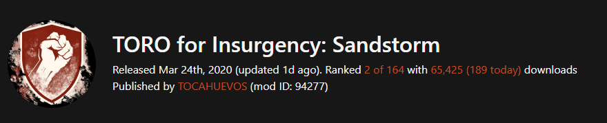

# Insurgency: SandStorm

## Custom Mods and Maps

Custom Mods and Maps are supported in Insurgency: Sandstorm via [mods.io](https://mods.io/). Please use this basic guide to get started using custom mods more in-depth information can be found at [mod.io Server Admin Guide](https://insurgencysandstorm.mod.io/guides/server-admin-guide)


This guide will show you how to install the custom map [TORO](https://insurgencysandstorm.mod.io/toro) as an example


### Get an Auth Token

To get started you will need a mod.io account, once you have signed in, click your username as the top right, and click **API Access** from the left navigation.

Under `OAuth 2 Management > Generate Access Token`, enter a name to give your token and give it read access and click `Create Token`.


Once the token is generated you will need to copy it to your game servers `Engine.ini`. Paste the following into `Engine.ini` and replace `TOKEN HERE` with your access token.

```
[/Script/ModKit.ModIOClient]
bHasUserAcceptedTerms=True
AccessToken=TOKEN HERE
```

### Add a Mod/Map

Add the `-Mods` parameter to your game server [start parameters](../configuration/start-parameters.md).

Next you will need to specify which mods you want to add to your game server.&#x20;

Create the `Mods.txt` file located `Insurgency/Config/Server/Mods.txt`&#x20;

```
mkdir -p Insurgency/Config/Server
touch Insurgency/Config/Server/Mods.txt
```


You can also specify your own`Mods.txt` file using `ModList=MyCustomModList.txt` or adding the mod id's to your start parameters using `-CmdModList="mod1,mod2,mod3"`


In the `txt` file you will need to specify each mod ID line by line. The mod ID can be found on the mods details page at [mod.io](https://insurgencysandstorm.mod.io/toro). Once restarted the mod will be available to use.



To use this custom map you will need to add it to your mapcycle and if required, your default map

Create `MapCyle.txt`and add the custom map to your mapcycle.

```
touch Insurgency/Config/Server/MapCyle.txt
   
```

```
(Scenario="Scenario_TORO_Checkpoint_Security",Lighting="Day",Mode="Checkpoint")
(Scenario="Scenario_TORO_Checkpoint_Insurgents",Lighting="Day",Mode="Checkpoint")
```

If you want the custom map to be the default edit your [start parameters](../configuration/start-parameters.md)

```
defaultmap="TORO"
defaultscenario="Scenario_TORO_Checkpoint_Security"
```

Once the server is restarted the custom map should be available on your game server.

## Resources

[Official Server Admin Guide](https://sandstorm-support.newworldinteractive.com/hc/en-us/articles/360049211072-Server-Admin-Guide)
