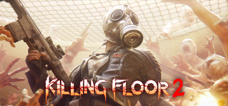

# Killing Floor 2

## Ports

* **Game Port** Default: 7777 UDP Handled by: `LinuxServer-KFEngine.ini`&#x20;
* **Query Port** Default: 27015 UDP Handled automatically or handled by parameters. The formula for finding query port assigned automatically is 19238 + assigned game port.&#x20;
* **Web Admin** Default: 8080 TCP Handled by: `KFWeb.ini`&#x20;
* **Steam Port** Default: 20560 UDP Handled automatically. The formula for finding the steam port is 12783 + Game Port.

## Resources

[Killing Floor 2 Official Server Wiki](https://wiki.tripwireinteractive.com/index.php?title=Dedicated\_Server\_%28Killing\_Floor\_2%29)

[Killing floor 2 Official Forums](https://forums.tripwireinteractive.com/index.php?categories/killing-floor-2.25/)

## Server Config Information

LinuxGSM installations contain `configSubDir=servername` in the command line by default, which creates a folder for config files named after the server. The default directory is `/home/user/serverfiles/KFGame/Config/kf2server` . Use these files to change server settings.

## Workshop Content

Killing Floor 2 supports [Steam Workshop](../steamcmd/workshop.md).&#x20;

Players on the Epic Store will not be able to download files hosted with the steam workshop.

### High disk IO using Steam Workshop

Killing Floor 2 will check workshop files at server start and when map changes occur.

There is a potential problem with Killing Floor 2 servers using the steam workshop that causes server disk usage to read/write at 100% and could damage hardware.

To avoid this problem keep the amount of workshop content as low as possible.&#x20;

Disk IO can be monitored with the `iotop` command.

**References:**

[TWI you destroyed my SSD forum post](https://forums.tripwireinteractive.com/index.php?threads/twi-you-destroyed-my-kf2-servers-ssd.2334936/)

[Server is going disk drive crazy forum post](https://forums.tripwireinteractive.com/index.php?threads/server-is-going-disk-drive-crazy.2333489/)

[Workshop map disk thrashing forum post](https://forums.tripwireinteractive.com/index.php?threads/workshop-map-disk-thrashing-is-back.2335275/)

