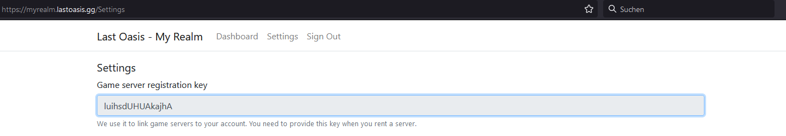
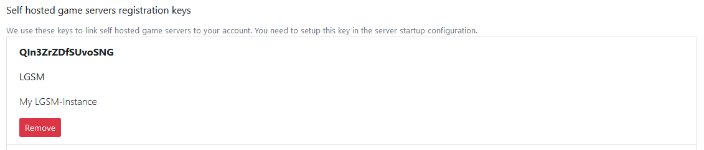
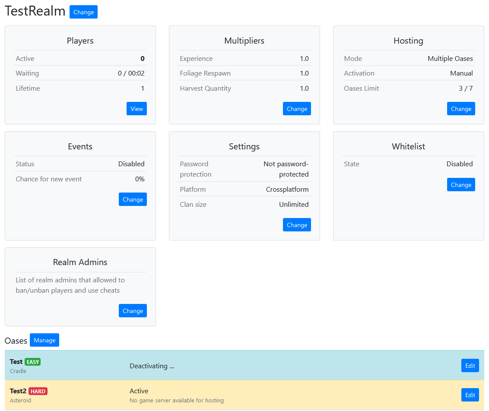
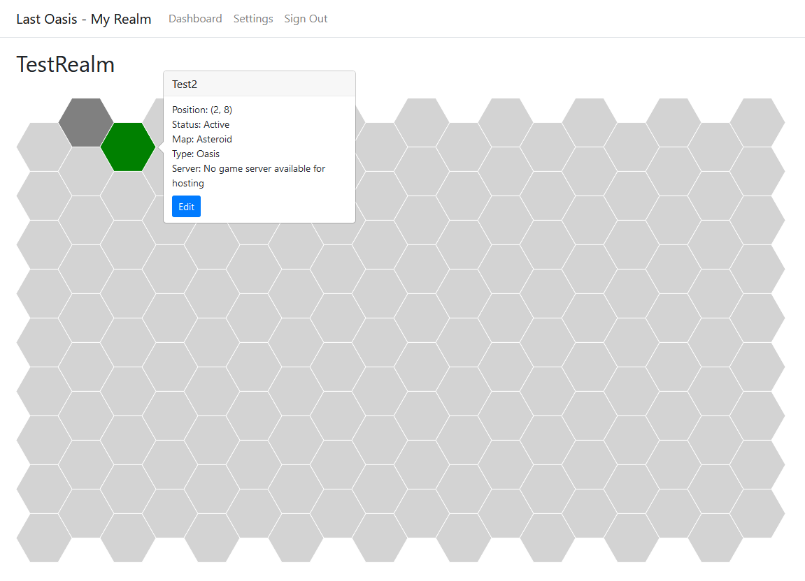

# Last Oasis

## Installation
In order to successfully download Last Oasis via steamcmd, you must provide login credentials to an account that has an active subscription for Last Oasis.
[Learn more](../steamcmd#steam-user-login).

Running a Last Oasis server also requires you to register an account at https://myrealm.lastoasis.gg

### Keys:
You need to provide your customer-key from https://myrealm.lastoasis.gg/Settings in order to start your Last Oasis instance:


**loserver.cfg**
```text
customerkey=xxxxxxxxxxxx
```



You also need to provide a specific provider-key per instance from https://myrealm.lastoasis.gg/Settings

You may have to add a new key at first.


**loserver.cfg**
```text
providerkey=xxxxxxxxxxxx
```



Every instance requires an unique provider-key! Add a new key for each instance!



## Oases
Every Game Server represents a single Oasis. In order to add a second Oasis to your Last Oasis -Realm, you need to [add a second instance to your LinuxGSM-installation](../features/multiple-game-servers#single-installation-with-multiple-instances).
Every running instance will allow you to have a new Oases running.

## Manage Oases
You can manage and configure the Oases in your realm on https://myrealm.lastoasis.gg




