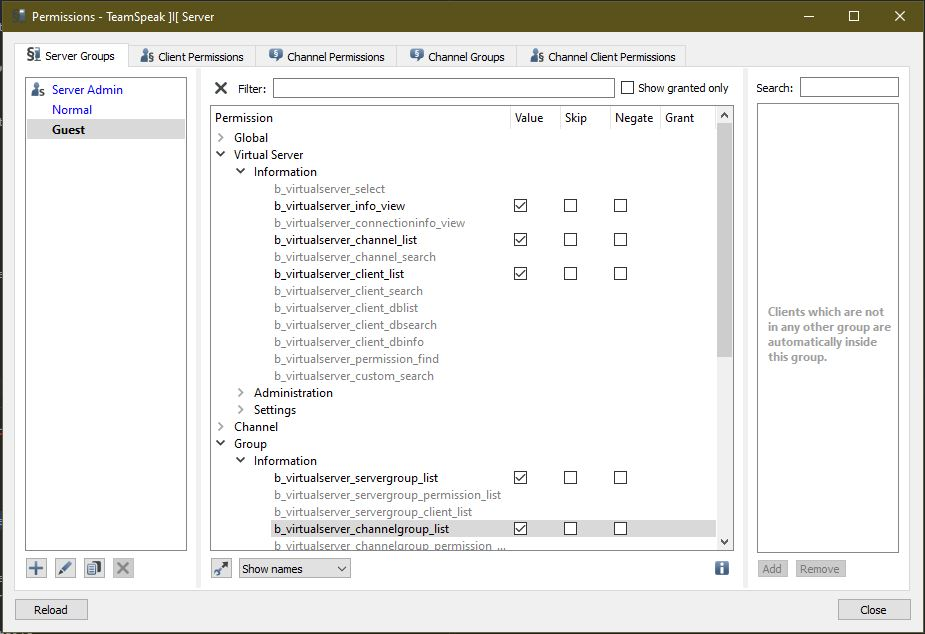

# TeamSpeak 3


## Enable Server Query

To enable server query certain permissions have to be enabled or the guest server group.

* Virtual Server
* b\_virtualserver\_info\_view
* b\_virtualserver\_channel\_list
* b\_virtualserver\_client\_list
* Group
* b\_virtualserver\_servergroup\_list
* b\_virtualserver\_channelgroup\_list

To enable these permissions first navigate to TeamSpeak3 Options and enable `Advanced permissions system`.

```text
Tools > Options > Application
```


Navigate to `server groups` server permissions and select guest.

```text
Permissions > Server Groups
```

Select the values shown below and close the menu.

* Virtual Server
  * Information
    * b\_virtualserver\_info\_view
    * b\_virtualserver\_channel\_list
    * b\_virtualserver\_client\_list
* Group
  * Information
    * b\_virtualserver\_servergroup\_list
    * b\_virtualserver\_channelgroup\_list



### Enable Query on LinuxGSM

Because a user has to manually enable server query with TeamSpeak 3, LinuxGSM has gamedig query disabled by default. Enabling will allow more information to be displayed in _details_ and enable monitor to use gamedig.

Copy the query mode settings from `_default.cfg`  to `common.cfg` and change `querymode`from `5` to `3`.

```text
## Query mode
# 1: session only
# 2: gamedig (gsquery fallback)
# 3: gamedig
# 4: gsquery
# 5: tcp
querymode="3"
querytype="teamspeak3"
```

## Connect to TeamSpeak 3 Server

You can connect to a TeamSpeak 3 server to input commands without the need for a TeamSpeak 3 client. This can be done by connecting to the query port using telnet.

Using PuTTY or equivalent select a telnet connection and enter the server IP and TeamSpeak 3 query port \(default:10011\).

### Useful Commands

#### Login

```text
login serveradmin <password>
```

#### Generating a new Privilege key

```text
use sid=<server-id>
tokenadd tokentype=0 tokenid1=6 tokenid2=0
```

> Note: Your server ID is usually 1

#### Reset your query password

See [change password](../commands/change-password.md).

## TeamSpeak 3 Databases

The TeamSpeak 3 database contains all user information, groups, and statistics for your server.

### SQLite Database

By default, TeamSpeak 3 uses an SQLite database file, which allows good performance for most users, and easy server transfers from one server to another. This method is recommended for most admins as it is the simplest database method to use.

### MariaDB

TeamSpeak 3 also allows admins to use MariaDB \(MySQL alternative\) manage the database. MariaDB is entirely optional and is not required so it is recommended that admins only use if they are comfortable.

Information about installing TeamSpeak 3 with MariaDB can be found [here](https://www.digitalocean.com/community/questions/setup-teamspeak-server-ubuntu-15-04).

### TSDNS

TSDNS is a system allowing admins to redirect a domain name to a given TeamSpeak 3 port.

If TeamSpeak 3 port is using the default port, you do not need to provide the port when you are giving your server address, you can use the IP or domain name directly.

TSDNS is useful to admins that are hosting multiple TeamSpeak 3 servers on a single dedicated server.

Further documentation can be found using the following command.

```text
cat ~user/serverfiles/tsdns/tsdns_settings.ini.sample
```

Additional information can be found [here](http://lastconnect.net/en/tsdnsdoc/).

Then you can copy the sample, edit it accordingly and restart your TeamSpeak 3 server to apply the changes.

```text
cd serverfiles/tsdns/
cp tsdns_settings.ini.sample tsdns_settings.ini
nano tsdns_settings.ini
cd ~
./ts3server restart
```

## Known issues

### IPv6

Some users with IPv6 enabled might encounter a server failing to start properly. To fix this edit `serverfiles/ts3-server.ini` to add a standard IPv4 \(`voice_ip; filetransfer_ip; query_ip`\) and remove the `, ::` from IPv6. Then as the server failed to start at the installation, the privilege key hasn't been generated. So you will need to use server query \(ID/Password have been generated for them\) to generate a new Server Admin privilege key.

### Accounting failed to register

If you find the following in the log you may need to remove a file that was created by teamspeak in /dev/shm/ `ERROR |Accounting | |failed to register local accounting service: File exists` The file is named "7gbhujb54g8z9hu43jre8" that is the problem for teamspeak. You need remove the file that is owned by another user and then try again to start the teamspeak server.

### Server Crashed after a while \(outdated and no licence\)

If the following message apprears in the log of the Teamspeak 3 Linux Server `Error creating ephemeral license: EXPIRED` You need to upgrade the version of the Teamspeak Server to a more up2date version.

