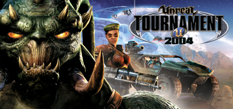

# Unreal Tournament 2004



## Server Files

LinuxGSM uses the most recent version of UT2K4 server available for Linux.

> v3369.3

This includes the various map packs such as the UT2004 Mega Pack.

Complete list of maps available with the LinuxGSM installer

```text
AS-BP2-Acatana.ut2           CTF-Avaris.ut2               CTF-Smote.ut2                DM-CBP1-Elegance.ut2         DM-DE-Ironic.ut2             DM-UCMP-PleasantValley.ut2   DOM-ScorchedEarth.ut2
AS-BP2-Jumpship.ut2          CTF-BP2-Concentrate.ut2      CTF-TwinTombs.ut2            DM-CBP1-Emperor.ut2          DM-DE-Osiris2.ut2            DM-UCMP-RancidMetal.ut2      DOM-SepukkuGorge.ut2
AS-BP2-Outback.ut2           CTF-BP2-Pistola.ut2          CTF-UCMP-Aithanarid.ut2      DM-CBP1-Finale.ut2           DM-Deck17.ut2                DM-UCMP-ThePits.ut2          DOM-Suntemple.ut2
AS-BP2-SubRosa.ut2           CTF-BridgeOfFate.ut2         CTF-UCMP-Aquatica.ut2        DM-CBP1-GoldenDawn.ut2       DM-DesertIsle.ut2            DM-UCMP-Xanadu.ut2           DOM-UCMP-Cerebral.ut2
AS-BP2-Thrust.ut2            CTF-CBP1-Betrayal.ut2        CTF-UCMP-DecaneCaldera.ut2   DM-CBP1-Neandertalus.ut2     DM-Flux2.ut2                 DM-UCMP2-Adamantium.ut2      DOM-UCMP2-1on1-Smelter.ut2
AS-CBP2-Thrust.ut2           CTF-CBP1-Concentrate.ut2     CTF-UCMP2-Campgrounds.ut2    DM-CBP1-Ougaldwin.ut2        DM-Forbidden.ut2             DM-UCMP2-Churn.ut2           DOM-UCMP2-Meskhenet.ut2
AS-Confexia.ut2              CTF-CBP1-Ferris.ut2          CTF-UCMP2-Enlightenment.ut2  DM-CBP1-Shifter.ut2          DM-Gael.ut2                  DM-UCMP2-Dynarak.ut2         Entry.ut2
AS-Convoy.ut2                CTF-CBP1-TechDream.ut2       CTF-UCMP2-Orcus.ut2          DM-CBP2-Achilles.ut2         DM-Gestalt.ut2               DM-UCMP2-Hieron.ut2          ONS-Adara.ut2
AS-FallenCity.ut2            CTF-CBP2-Bahera.ut2          CTF-UCMP2-RottenCity.ut2     DM-CBP2-Archipelago.ut2      DM-Goliath.ut2               DM-UCMP2-Saiko.ut2           ONS-ArcticStronghold.ut2
AS-Glacier.ut2               CTF-CBP2-Botanic.ut2         CTF-UCMP2-Sublimity.ut2      DM-CBP2-Azures.ut2           DM-HyperBlast2.ut2           DM-UCMP2-Taron.ut2           ONS-Aridoom.ut2
AS-Junkyard.ut2              CTF-CBP2-Decadence.ut2       CTF-UCMP2-Vadamerca.ut2      DM-CBP2-Buliwyf.ut2          DM-Icetomb.ut2               DM-UCMP2-Thebes.ut2          ONS-Ascendancy.ut2
AS-MotherShip.ut2            CTF-CBP2-Deep.ut2            CTF-UCMP3-Tidal.ut2          DM-CBP2-Drakonis.ut2         DM-Inferno.ut2               DM-UCMP3-Altitude.ut2        ONS-CBP2-Argento.ut2
AS-RobotFactory.ut2          CTF-CBP2-Gazpacho.ut2        CTF-UCMP4-Talya.ut2          DM-CBP2-Griffin.ut2          DM-Injector.ut2              DM-UCMP3-Gantham.ut2         ONS-CBP2-Brassed.ut2
AS-UCMP2-Cruciatus.ut2       CTF-CBP2-Pistola.ut2         CTF-UCMP4-Virility.ut2       DM-CBP2-Kadath.ut2           DM-Insidious.ut2             DM-UCMP3-Glorian.ut2         ONS-CBP2-Mirage.ut2
AS-UCMP3-IslandStrike.ut2    CTF-CBP2-Skorbut.ut2         DM-1on1-Albatross.ut2        DM-CBP2-Kerosene.ut2         DM-IronDeity.ut2             DM-UCMP3-Sympathy.ut2        ONS-CBP2-Pasargadae.ut2
BR-Anubis.ut2                CTF-Chrome.ut2               DM-1on1-Crash.ut2            DM-CBP2-Khrono.ut2           DM-Junkyard.ut2              DM-UCMP4-Elucidation.ut2     ONS-CBP2-Tropica.ut2
BR-Bifrost.ut2               CTF-Citadel.ut2              DM-1on1-Desolation.ut2       DM-CBP2-KillbillyBarn.ut2    DM-Leviathan.ut2             DM-UCMP4-Mania.ut2           ONS-CBP2-Valarna.ut2
BR-BridgeOfFate.ut2          CTF-Colossus.ut2             DM-1on1-Idoma.ut2            DM-CBP2-Koma.ut2             DM-Metallurgy.ut2            DM-UCMP4-Propaganda.ut2      ONS-CBP2-Yorda.ut2
BR-CBP1-BreakLimit2004.ut2   CTF-DE-ElecFields.ut2        DM-1on1-Irondust.ut2         DM-CBP2-KroujKran.ut2        DM-Morpheus3.ut2             DM-UCMP4-Speos.ut2           ONS-Crossfire.ut2
BR-CBP2-Aquarius.ut2         CTF-DE-LavaGiant2.ut2        DM-1on1-Mixer.ut2            DM-CBP2-Masurao.ut2          DM-Oceanic.ut2               DOM-Access.ut2               ONS-Dawn.ut2
BR-CBP2-Bahera.ut2           CTF-December.ut2             DM-1on1-Roughinery.ut2       DM-CBP2-Meitak.ut2           DM-Phobos2.ut2               DOM-Aswan.ut2                ONS-Dria.ut2
BR-Canyon.ut2                CTF-DoubleDammage.ut2        DM-1on1-Serpentine.ut2       DM-CBP2-Niflheim.ut2         DM-Plunge.ut2                DOM-Atlantis.ut2             ONS-FrostBite.ut2
BR-Colossus.ut2              CTF-Face3.ut2                DM-1on1-Spirit.ut2           DM-CBP2-Reconstruct.ut2      DM-Rankin.ut2                DOM-CBP1-Aphrodite.ut2       ONS-Icarus.ut2
BR-DE-ElecFields.ut2         CTF-FaceClassic.ut2          DM-1on1-Squader.ut2          DM-CBP2-Summit.ut2           DM-Rrajigar.ut2              DOM-CBP1-Hathor.ut2          ONS-IslandHop.ut2
BR-Disclosure.ut2            CTF-Geothermal.ut2           DM-1on1-Trite.ut2            DM-CBP2-TelMecoMEX.ut2       DM-Rustatorium.ut2           DOM-CBP1-Verde.ut2           ONS-Primeval.ut2
BR-IceFields.ut2             CTF-Grassyknoll.ut2          DM-Antalus.ut2               DM-CBP2-Tempest.ut2          DM-Sulphur.ut2               DOM-CBP2-Gerroid.ut2         ONS-RedPlanet.ut2
BR-Serenity.ut2              CTF-Grendelkeep.ut2          DM-Asbestos.ut2              DM-CBP2-TensileSteel.ut2     DM-TheDeck2004.ut2           DOM-CBP2-Summit.ut2          ONS-Severance.ut2
BR-Skyline.ut2               CTF-January.ut2              DM-BP2-Calandras.ut2         DM-CBP2-Torkenstein.ut2      DM-TokaraForest.ut2          DOM-Conduit.ut2              ONS-Torlan.ut2
BR-Slaughterhouse.ut2        CTF-Lostfaith.ut2            DM-BP2-GoopGod.ut2           DM-CBP2-Tydal.ut2            DM-TrainingDay.ut2           DOM-Core.ut2                 ONS-Tricky.ut2
BR-TwinTombs.ut2             CTF-Magma.ut2                DM-CBP1-Arkanos.ut2          DM-Compressed.ut2            DM-UCMP-1on1-Derelict.ut2    DOM-Junkyard.ut2             ONS-UCMP-ABC-ECE.ut2
BR-UCMP2-Sublimity.ut2       CTF-Maul.ut2                 DM-CBP1-AugustNoon.ut2       DM-Corrugation.ut2           DM-UCMP-BloodRun.ut2         DOM-OutRigger.ut2            ONS-UCMP-ABC.ut2
CTF-1on1-Joust.ut2           CTF-MoonDragon.ut2           DM-CBP1-BlackJackal.ut2      DM-Curse4.ut2                DM-UCMP-Contrast.ut2         DOM-Renascent.ut2            ONS-Urban.ut2
CTF-AbsoluteZero.ut2         CTF-Orbital2.ut2             DM-CBP1-Downgrave.ut2        DM-DE-Grendelkeep.ut2        DM-UCMP-ImMortalis.ut2       DOM-Ruination.ut2            VCTF-UCMP2-RiverCanyon2.ut2
```
