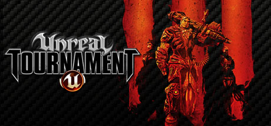

# Unreal Tournament 3



## Server files

LinuxGSM uses the most recent version of UT3 server available for Linux.

> v2.1 \(3808\) \[Compiled: Apr 22 2009 04:27:51\].

Unreal Tournament 3 Requires a few alterations from the official server download. Because of this the LinuxGSM version of the server files includes the following.

* Patch 5 \(v2.1\)
* Titan Expansion Pack
* Gamespy Server Patch
* WebAdmin 1.17

## Ports

* Game Port 7777 UDP handled by Parms
* Query port 6500 UDP handled by parms \(does not work\)
* Web Admin 8080 TCP handled by UTWeb.ini

## **Game Types**

This is a list of the valid gametypes:

| Name | GameType |
| :--- | :--- |
| Deathmatch | UTGame.UTDeathmatch |
| Capture the Flag | UTGameContent.UTCTFGame\_Content |
| Warfare | UTGameContent.UTOnslaughtGame\_Content |
| Vehicle Capture the Flag | UTGameContent.UTVehicleCTFGame\_Content |
| Team Deathmatch | UTGame.UTTeamGame |
| Duel | UTGame.UTDuelGame |

## **Mutators**

**I**f you want to run more than one mutator separate them with commas.

```text
 ?mutator=UTGame.UTMutator_Instagib,UTGame.UTMutator_LowGrav
```

This is a list of the valid mutators shipped with the retail version:

| Name | MutatorIdentifier |
| :--- | :--- |
| Instagib | UTGame.UTMutator\_Instagib |
| BigHead | UTGame.UTMutator\_BigHead |
| Low Gravity | UTGame.UTMutator\_LowGrav |
| Super Berserk | UTGame.UTMutator\_SuperBerserk |
| Friendly Fire | UTGame.UTMutator\_FriendlyFire |
| No Translocator | UTGame.UTMutator\_NoTranslocator |
| Speed Freak | UTGame.UTMutator\_SpeedFreak |
| Handicap | UTGame.UTMutator\_Handicap |
| No Powerups | UTGame.UTMutator\_NoPowerups |
| Slomo | UTGame.UTMutator\_Slomo |
| Weapon Replacement | UTGame.UTMutator\_WeaponReplacement |
| Weapon Respawn | UTGame.UTMutator\_WeaponsRespawn |

## **Common Variables**

|  |  |
| :--- | :--- |
| MaxPlayers=&lt;number&gt; | Maximum number of players on the server \(overrides ini setting\) |
| MinNetPlayers=&lt;number&gt; | Minimum number of players before a match starts \(real players not bots\) |
| bShouldAdvertise=\[True\|False\] | Show the server in the server browser \(default: true\) |
| bIsLanMatch=\[True\|False\] | Is this a LAN only game? \(default: false\) |
| bIsDedicated=\[True\|False\] | Changes dedicated server flag \(default: false, even if started as dedicated\) |
| GamePassword=&lt;password&gt; | Sets a game password |
| AdminPassword=&lt;password&gt; | Sets an admin password |
| Port=&lt;port&gt; |  Sets the server game port \(default: 7777; can also be changed via the INI file\) |
| QueryPort=&lt;port&gt; | Sets the server query port \(default: 6500\) |
| GoalScore=&lt;number&gt; | Sets the max frags / max caps before the server will change maps. |
| bUsesStats=\[True\|False\] | Report stats or not? |
| TimeLimit=&lt;number&gt; | Sets the timelimit in minutes for each map. |

Most of these can be set in the server's `UTGame.ini`, so there's no need to clutter up the command line.

## **Server GameSpy Login**

All servers require a **unique** login to allow a server to show in the master server list. This login has to be created via the client "Create Profile". You can create multiple profiles under the same email address but you must use the same password for each if you do so.

## **Server Names**

Server names can be specified in the server's `UTGame.ini`

The `ServerDescription` field isn't in plain ascii or text as you and I know it. Instead its in UCS2 \(UTF-16\) which is then serialised as numeric strings.

## **Enable Mapvote**

Edit the `UTGame.ini`. Under the `[UTGame.UTGame]` section, be sure to have this:

```text
bAllowMapVoting=True
VoteDuration=45
GameSpecificMapCycles=(GameClassName="UTDeathmatch",Maps=("DM-Arsenal","DM-Biohazard","DM-CarbonFire","DM-Deck","DM-Defiance","DM-Deimos","DM-Diesel","DM-Fearless","DM-Gateway","DM-HeatRay","DM-RisingSun","DM-Sanctuary","DM-Sentinel","DM-ShangriLa"))
GameSpecificMapCycles=(GameClassName="UTTeamGame",Maps=("DM-Arsenal","DM-Biohazard","DM-CarbonFire","DM-Deck","DM-Defiance","DM-Deimos","DM-Diesel","DM-Fearless","DM-Gateway","DM-HeatRay","DM-RisingSun","DM-Sanctuary","DM-Sentinel","DM-ShangriLa"))
GameSpecificMapCycles=(GameClassName="UTCTFGame_Content",Maps=("CTF-Coret","CTF-Hydrosis","CTF-Reflection","CTF-Vertebrae","CTF-OmicronDawn","CTF-Strident"))
GameSpecificMapCycles=(GameClassName="UTVehicleCTFGame_Content",Maps=("VCTF-Containment","VCTF-Corruption","VCTF-Kargo","VCTF-Necropolis","VCTF-Sandstorm","VCTF-Suspense"))
GameSpecificMapCycles=(GameClassName="UTOnslaughtGame_Content",Maps=("WAR-Avalanche","WAR-Downtown","WAR-Dusk","WAR-FloodGate","WAR-Islander","WAR-Islander_Necris","WAR-MarketDistrict","WAR-OnyxCoast","WAR-Powersurge","WAR-Serenity","WAR-Serenity_Necris","WAR-SinkHole","WAR-TankCrossing","WAR-Torlan","WAR-Torlan_Leviathan","WAR-Torlan_Necris"))
GameSpecificMapCycles=(GameClassName="UTDuelGame",Maps=("DM-Arsenal","DM-Biohazard","DM-CarbonFire","DM-Deck","DM-Defiance","DM-Deimos","DM-Diesel","DM-Fearless","DM-Gateway","DM-HeatRay","DM-RisingSun","DM-Sanctuary","DM-Sentinel","DM-ShangriLa"))
```

## **Admin Commands**

You meant to be able to admin the game using rcon but when we tried it although adminlogin worked none of the subsequent commands did.

First off login with: AdminLogin &lt;password&gt;

The you can use the following command:

* AdminLogin &lt;password&gt; - Logs you in as an admin
* AdminLogout - Logs you out of admin mode
* AdminRestartMap - Restarts the current map
* AdminChangeMap &lt;MapName&gt; - Loads a different map \(gametype will change too, depending on map\)
* Admin addbots &lt;\#&gt; - Adds number of bots
* Admin killbots - Removes all bots
* AdminPlayerList - Shows PlayerID of players
* Adminkick &lt;playername&gt; - Kicks player from current game
* Adminkickban &lt;playername&gt; - Kicks player from current game and bans player from reconnecting \(bans are stored in .ini file for later editing\)
* AdminForceVoiceMute &lt;playername&gt; - Blocks a player from sending voip to others
* AdminForceVoiceUnMute &lt;playername&gt; - Allows a player to resume sending voip to others
* AdminForceTextMute &lt;playername&gt; - Blocks a player from sending text to others
* AdminForceTextUnMute &lt;playername&gt; - Allows a player to resume sending text to others
* AdminPublishMapList - Overrides the server's map list for the current game type with the one on the client that used the command

When your done you can logout with: AdminLogout

