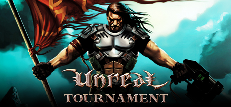

# Unreal Tournament 99



## Server Files

Unreal Tournament 99 Requires a few alterations from the official server download. Because of this, the LinuxGSM version of the server files includes the following.

* OldUnreal-UTPatch469a-Linux.tar.bz2 ([OldUnreal Patch](https://www.oldunreal.com/cgi-bin/yabb2/YaBB.pl?num=1569587267))
* ut-server-436.tar (Latest Official Version)
* UTBonusPack.zip
* UTBonusPack2.zip (maps only)
* UTInoxxPack.zip
* UTBonusPack4.zip

## Server Resources

[UT99.org is a community website for UT99](https://ut99.org)

[OldUnreal is another community website](https://www.oldunreal.com/index.html)

## Config File Settings

With a default LinuxGSM Install, server settings can be configured in this file:

`/home/user/serverfiles/System/ut99server.ini`

You can change most of these settings in a browser by enabling the webserver and putting in settings there.&#x20;

```
[Engine.GameReplicationInfo]
ServerName= 
ShortName=
AdminName=
AdminEmail=
Region=0
MOTDLine1=
MOTDLine2=
MOTDLine3=
MOTDLine4= 

[Botpack.ChallengeBotInfo]
Difficulty=4

[Botpack.DeathMatchPlus]
bNoviceMode=True
bHardCoreMode=True
bUseTranslocator=False
bCoopWeaponMode=False
MinPlayers=10
AirControl=0.350000
FragLimit=30
TimeLimit=0
bChangeLevels=True
bMegaSpeed=False
bAltScoring=False
bMultiWeaponStay=True
bForceRespawn=False
bTournament=False
NetWait=10
RestartWait=15
MaxCommanders=0
InitialBots=9
bNoMonsters=True
bHumansOnly=False
bClassicDeathMessages=False
MinFOV=80.000000
MaxFOV=130.000000
MaxNameChanges=0

[UWeb.WebServer]
Applications[0]=UTServerAdmin.UTServerAdmin
ApplicationPaths[0]=/ServerAdmin
Applications[1]=UTServerAdmin.UTImageServer
ApplicationPaths[1]=/images
DefaultApplication=0
ListenPort=8076
bEnabled=True

[UTServerAdmin.UTServerAdmin]
AdminUsername=
AdminPassword=
```
