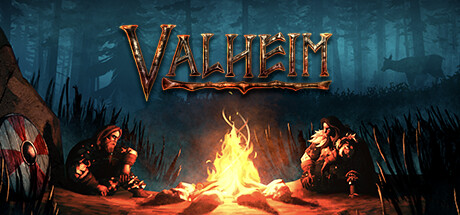

# Valheim

<figure><figcaption></figcaption></figure>

## Server Resources

* [Official Dedicated Server Guide](https://valheim.fandom.com/wiki/Valheim\_Dedicated\_Server)

## Valheim Servers require Passwords

Valheim servers require a server password to start a server. This means it is not possible to connect to a Valheim server unless you know the password.

## Direct connect to a Valheim Server

The Valheim in-game browser can be slow, as a workaround you can directly connect to a server in-game through the Join Game tab by pressing the Join IP button, or by adding a server to your Steam server browser favorites. To access the Steam server list, at the top left of the Steam library window go `View > Game Servers > Favorites`, and click the `blue +` button. Use `./vhserver details` to list the current query port. The default port is 2457.

## Long Server Names

Valheim has been previously known to have problems with long server names and special characters, if you are having trouble connecting to a server try making its name shorter or remove special characters.

## Other Resources:

Add admins to Valheim server:

[https://nodecraft.com/support/games/valheim/adding-admins-to-your-valheim-server](https://nodecraft.com/support/games/valheim/adding-admins-to-your-valheim-server)
