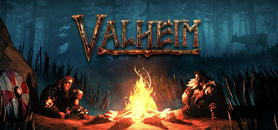

# Valheim

<figure><figcaption></figcaption></figure>

## Server Resources

* [Official Dedicated Server Guide](https://valheim.fandom.com/wiki/Valheim\_Dedicated\_Server)

## Valheim Servers require Passwords

Valheim servers require a server password to start a server. This means it is not possible to connect to a Valheim server unless you know the password.

## Direct connect to a Valheim Server

The Valheim in-game browser can be slow, as a workaround you can directly connect to a server in-game through the Join Game tab by pressing the Join IP button, or by adding a server to your Steam server browser favorites. To access the Steam server list, at the top left of the Steam library window go `View > Game Servers > Favorites`, and click the `blue +` button. Use `./vhserver details` to list the current query port. The default port is 2457.

## Crossplay

LinuxGSM starts Valheim with the `-crossplay` parameter by default. Crossplay routes connections through the PlayFab relay so that Xbox and PC Game Pass players can join alongside Steam players.

If your server is Steam-only and players connect by direct IP or through the Steam server browser, you may want to disable crossplay. With crossplay enabled, players may not be able to reach the server directly.

To disable crossplay, copy the `startparameters` line from `lgsm/config-lgsm/vhserver/_default.cfg` into your instance config (for example `lgsm/config-lgsm/vhserver/vhserver.cfg`) and remove `-crossplay`:

```bash
startparameters="-name '${servername}' -password ${serverpassword} -port ${port} -world ${worldname} -public ${public} -savedir '${savedir}' -saveinterval ${saveinterval} -backups ${backups} -backupshort ${backupshort} -backuplong ${backuplong} -instanceid ${instanceid} ${logFile:+ -logFile '${logFile}'} ${worldmodifiers:+ ${worldmodifiers}}"
```


Copy the line from your current `_default.cfg` rather than this page, in case the defaults have changed. Restart the server for the change to take effect.


With crossplay disabled and the server public, deeper monitoring is available by setting `querymode="2"` and `querytype="protocol-valve"` in your instance config.

See [Start Parameters](../configuration/start-parameters.md) for more on overriding `startparameters`.

## Long Server Names

Valheim has been previously known to have problems with long server names and special characters, if you are having trouble connecting to a server try making its name shorter or remove special characters.

## Other Resources:

Add admins to Valheim server:

[https://nodecraft.com/support/games/valheim/adding-admins-to-your-valheim-server](https://nodecraft.com/support/games/valheim/adding-admins-to-your-valheim-server)
