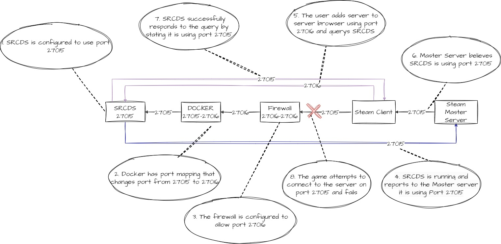
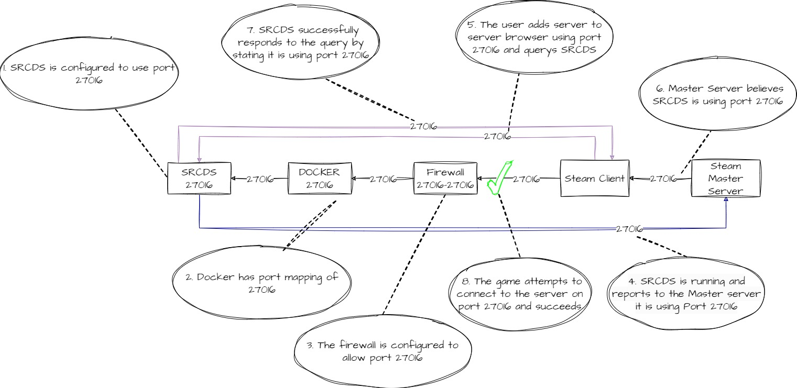

# Source Engine

## Default ports

Both Source engine and GoldSrc engine use the following ports by default.

* Game Port: 27015
* Query Port: 27015
* RCON Port: 27015
* Client Port: 27020&#x20;
* Source TV: 27005

## Static Port Mapping (NAT/Docker)

The port that is configured in the start parameters _must_ be the port that is exposed to the Internet. This is because the game server reports the port that it is configured in start parameters to use to the master server. If this does not match the game client will not be able to connect to the server.                                                                                                                                                                                                                                                                                                                                                                                                                                                                                                                                                                                      &#x20;

<figure><figcaption>
Changing port using Docker or firewall
</figcaption></figure>

<figure><figcaption>
Changing port using the start parameters
</figcaption></figure>

