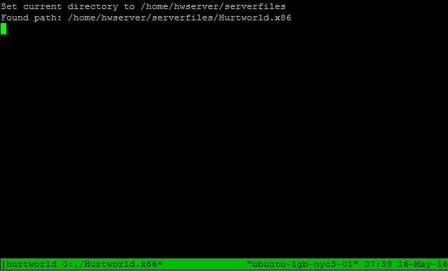

# tmux

LinuxGSM uses [tmux](https://tmux.github.io) to run servers in the background, so the server instance is not terminated when you close a terminal session.


LinuxGSM requires _tmux =&gt; 1.6_


Tmux is a key component of LinuxGSM and replaced [screen](http://en.wikipedia.org/wiki/GNU_Screen) which was used on earlier versions. tmux has a few improvements over screen; mainly being better at handling standard Linux users, this was a major issue when developing with screen. tmux allows LinuxGSM to call up a game server running in the background so you can see what it is doing; this feature is available with [console](../commands/console.md) feature.



### tmuxception

Some server admins have attempted to run LinuxGSM within a `tmux` or `screen` session. As LinuxGSM calls tmux it is not possible to run LinuxGSM within a tmux or screen session.


## Known Issues

### Tmux 1.8

tmux 1.8 has an issue that prevents console logging from working. This is because the `pipe-pane` feature is broken in tmux 1.8, causing it not to output the console to the console log files. The only solution is to use another version of tmux.


tmux 1.8 is installed on CentOS 7 by default. See guide below to install a newer version.


## create session failed: Operation not permitted

This issue normally occuires with CentOS and is caused by the standard user not having permissions to user _`/dev/ptmx`_.

```text
create session failed: ./srcds_linux -game csgo: Operation not permitted
```

To fix this the user needs to be part of the `tty` group.

```text
usermod -G tty csgoserver
```

To confirm the user has been added check _`/etc/group`_.

```text
grep tty /etc/group
```

```text
tty:x:5:csgoserver
```

## Upgrade tmux CentOS 7 using Ghettoforge

If the default version of tmux \(1.8\) installed on CentOS 7 it will fail to log the console output. To fix this it is possible to upgrade to a newer version of tmux using the [Ghettoforge](http://ghettoforge.org) repository.

Install Ghettoforge with the following command.

```text
yum install http://mirror.ghettoforge.org/distributions/gf/gf-release-latest.gf.el7.noarch.rpm
```

Install tmux using the Ghettoforge repo.

```text
yum --enablerepo=gf-plus install tmux
```

Once installed restart the server.

```text
restart
```
