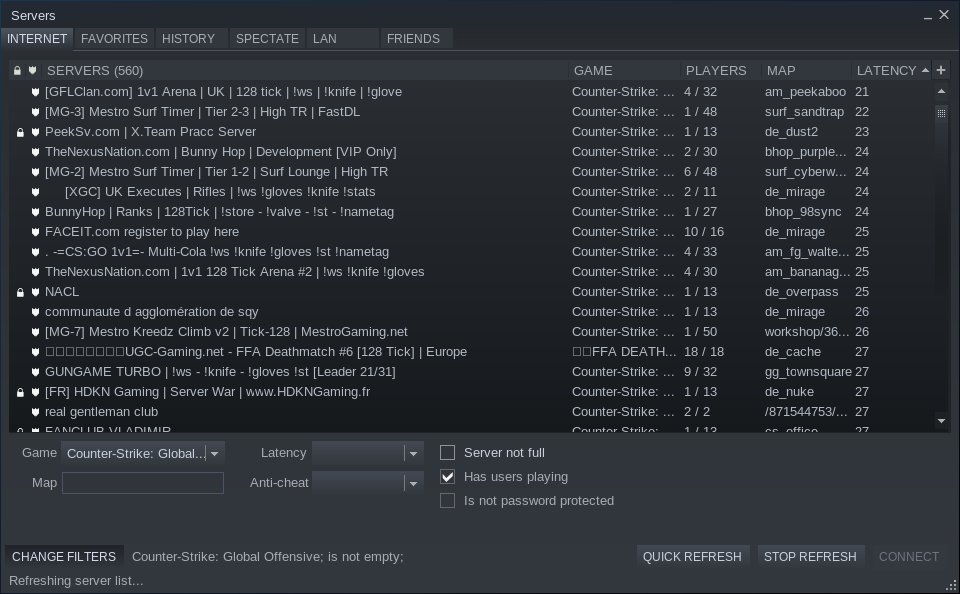

# Steam Master Server

For a game server to be seen online it normally has to register itself on a master server list. Valve maintains a master server for many different games. The master server is used to populate the server browser.



## Master Server Check

LinuxGSM can check that supported game servers are listed on the steam master server. This is useful for confirming that the server is actually registering and to help diagnose issues.


Not all game servers support this option but if it does the setting is set to true by default. 


```text
steammaster="true"
```

