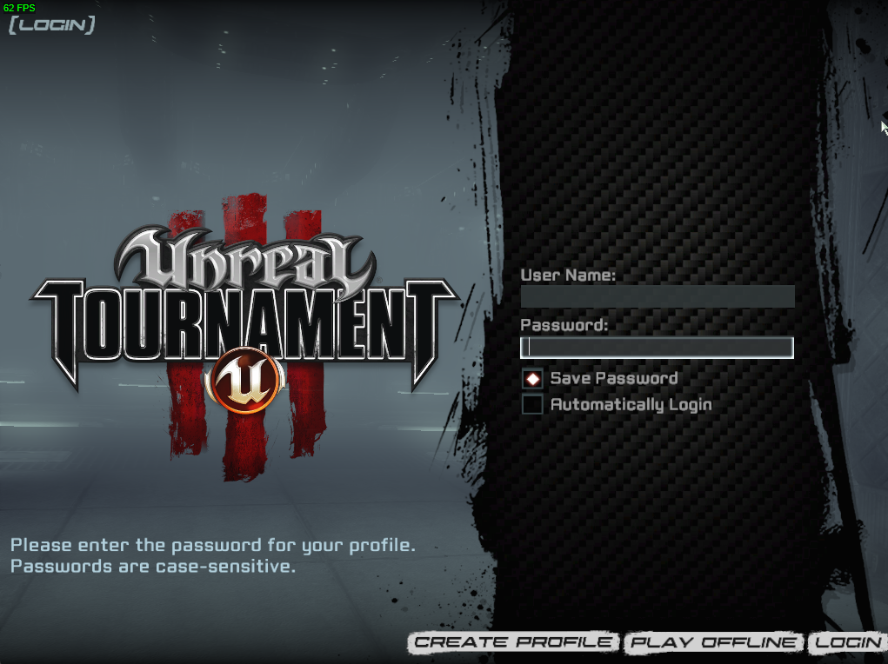

# Workshop

Many Steam games support the [Steam Workshop](https://steamcommunity.com/workshop). It is an easy way to share community game modes, maps, skins, and other community-made content.

For game servers, the Workshop allows community content (mainly maps and game modes) to be made available to play on game servers. The Workshop content is automatically downloaded by the game client of the player connecting to the server. This removed the need to set up a [FastDL](../commands/fastdl.md) server.

LinuxGSM adds workshop pre-configuration to game server scripts when available.

## Supported Games Servers

This is a list of game servers that are known to support Workshop

* Ark: Survival Evolved
* ARMA 3
* Day of Infamy
* Counter-Strike 2
* Garrys Mod
* Hurtworld
* Insurgency: Sandstorm
* Killing Floor 2
* Natural Selection 2
* Starbound

## Steam Web API Key/Auth Key

Some game servers require a Steam API key to access Workshop content. To get this key visit the [Steam API key page](https://steamcommunity.com/dev/apikey) and follow the instructions.


Do not share your private API key.


## Items and Collections

The Steam Workshop is made up of individual items such as maps, game modes, skins, etc, and also collections of these items. Game servers can download these items and collections by getting their unique ID number and adding it to the game server config or parameter. For collections, it is possible to find and use an existing one or create your own.

### Get an Item or Collection ID

To get and item or collection ID browse to the item you want to add and look at the URL; it will contain the required ID number. In the example below the ID is `3075706807`.

```
https://steamcommunity.com/sharedfiles/filedetails/?id=3075706807
```

### Create a Collection

Creating a collection is a great way to manage and group all the content that you want on your game server.&#x20;

To create your collection go to the collections section of your games Workshop, and select `Create Collection`.

<figure><figcaption></figcaption></figure>

Fill out the form.

<figure><figcaption></figcaption></figure>

<figure><figcaption></figcaption></figure>

Add any maps to the collection, then publish the completed collection. Then get the collection ID which can be found on the page URL. The collection ID in the url below is `157384458`.

```
https://steamcommunity.com/sharedfiles/filedetails/?id=157384458
```

## Server Configurations

###
